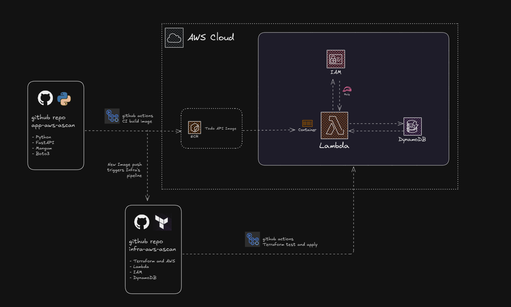

# AWS AScan Todo Application

A serverless todo application built using AWS Lambda, IAM and DynamoDB.



## Overview

This project implements a serverless todo API that allows users to create, read, update, and delete todo items. The application is containerized and deployed on AWS Lambda, with DynamoDB as the database backend.

## Architecture

The application follows a serverless architecture with the following components:
- **AWS Lambda**: Serverless functions to process API requests
- **DynamoDB**: NoSQL database to store todo items
- **Amazon ECR**: Container registry to store the application Docker image

## Automated Deployment

This project features a fully automated deployment process. All you need to do is push your code to the main branch, and the CI/CD pipeline will handle everything else.

### How it Works

1. Push your code changes to the main branch
2. The GitHub Actions workflow in this repository is automatically triggered
3. The workflow builds a Docker image containing the application and all its dependencies
4. The image is tagged and pushed to Amazon ECR
5. Upon successful image deployment, the workflow automatically triggers a repository dispatch event to the infrastructure repository (`infra-aws-ascan`)
6. The infrastructure repository's pipeline provisions all required AWS resources using Terraform:
   - Lambda function configured to use the newly built Docker image
   - DynamoDB table for data storage
   - API Gateway for API endpoints
   - IAM permissions to allow secure communication between services

No manual deployment steps are required. The entire process from code commit to a fully deployed and functional application is automated.

## Development

### Prerequisites

- GitHub account with access to this repository
- AWS credentials configured as GitHub secrets (for the CI/CD pipeline)

## CI/CD Pipeline

This project utilizes GitHub Actions for continuous integration and deployment.

The CI pipeline is defined in `.github/workflows/docker-image.yml`.

### Infrastructure as Code

The infrastructure repository (`infra-aws-ascan`) contains Terraform files that provision:

1. AWS Lambda function configured to use the container image created here
2. DynamoDB table for storing todo items
3. IAM roles and permissions for secure service communication
4. API Gateway configuration for RESTful API endpoints

All infrastructure is deployed automatically when a new container image is built.

## API Documentation

The application provides the following API endpoints:

- `GET /todos` - Retrieve all todo items
- `GET /todos/{id}` - Retrieve a specific todo item
- `POST /todos` - Create a new todo item
- `PUT /todos/{id}` - Update an existing todo item
- `DELETE /todos/{id}` - Delete a todo item

### Request/Response Examples

**Create Todo**
```
POST /todos
{
  "title": "Complete documentation",
  "done": false,
  "priority": 1,
}
```

**Response**
```
{
  "id": "a1b2c3d4-e5f6-7890-abcd-ef1234567890",
  "title": "Complete documentation",
  "done": false,
  "priority": 2,
}
```

## Environment Variables

The application requires the following environment variables:

- `AWS_REGION` - AWS region where resources are deployed
- `DYNAMODB_TABLE` - Name of the DynamoDB table for todos

## Troubleshooting

Common issues and their solutions:

- **API returns 5xx errors**: Check Lambda logs in CloudWatch
- **Container fails to start**: Verify environment variables are properly set
- **CI pipeline fails**: Ensure AWS credentials are properly configured in GitHub secrets
- **Infrastructure deployment fails**: Check the workflow logs in the `infra-aws-ascan` repository